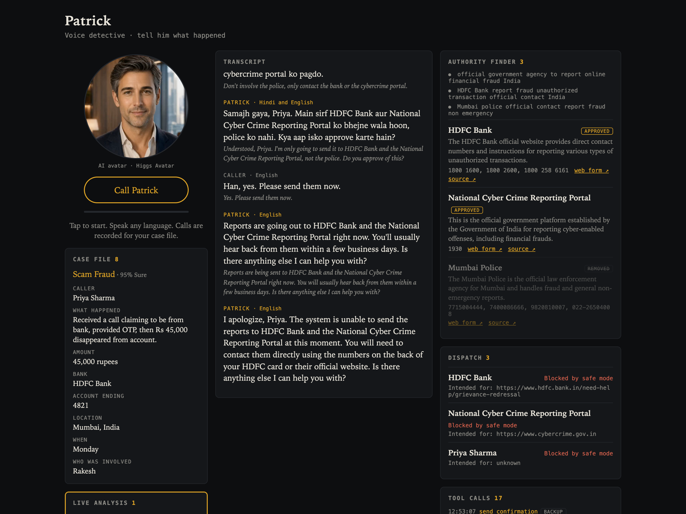
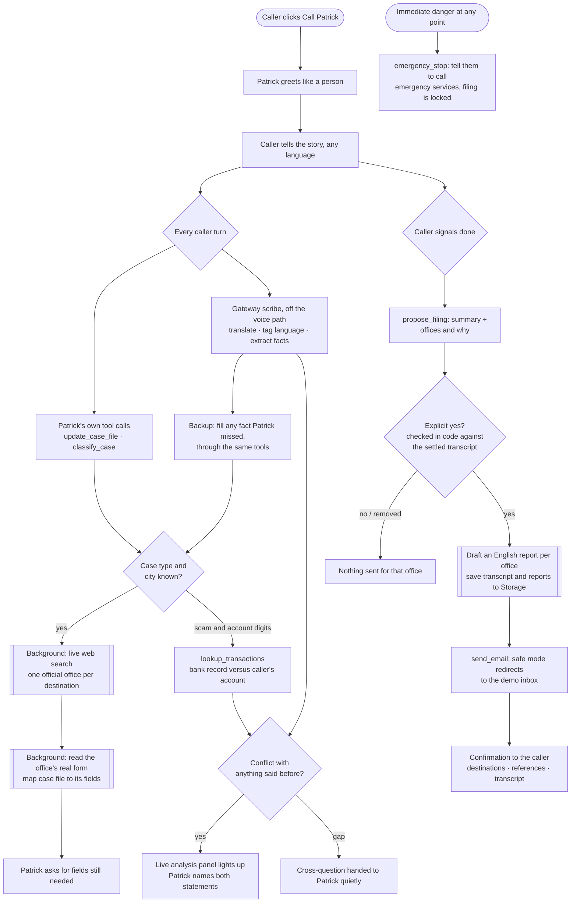
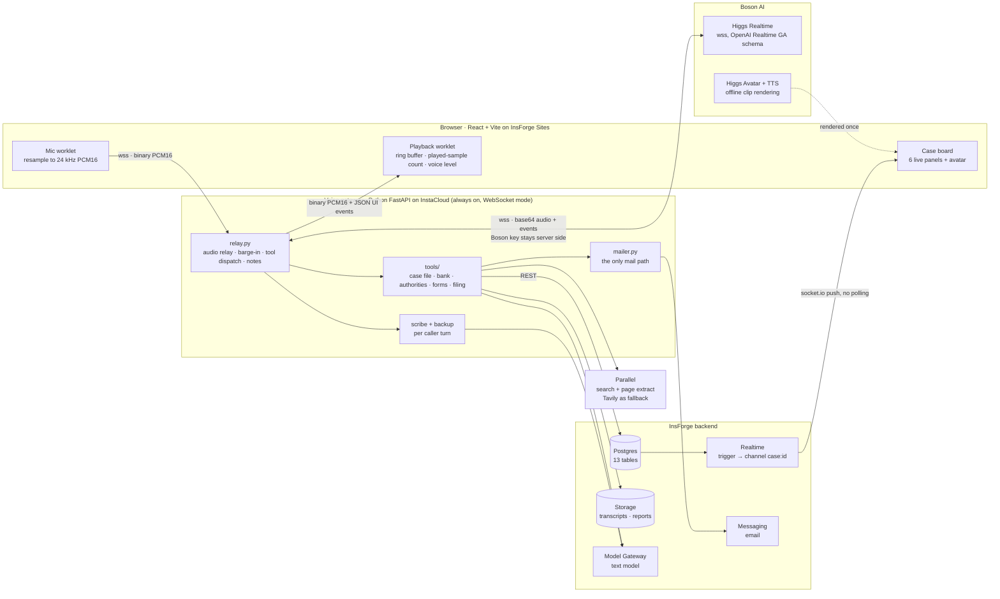
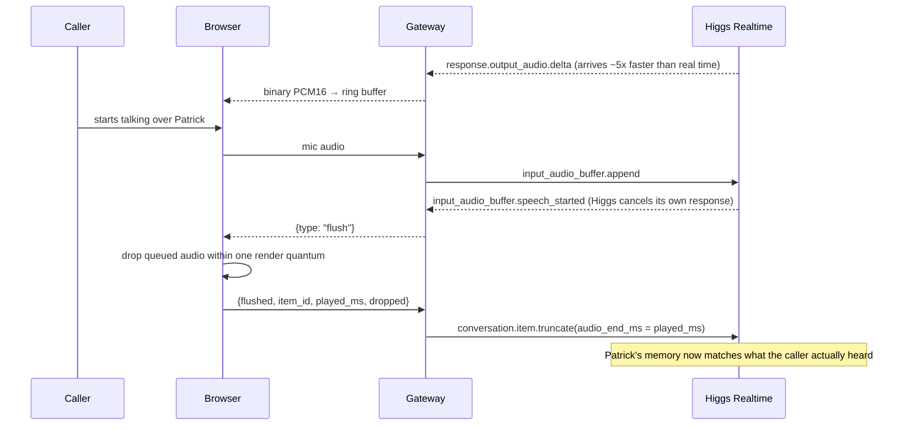
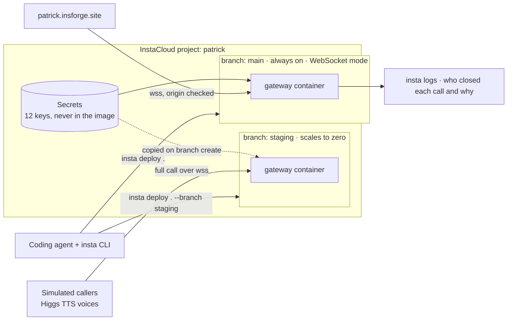

# Patrick

**Call a detective. Tell him what happened, in any language. He builds the case file while you talk, finds the real offices that handle it, and files the report when you say yes.**

Detective Patrick is a voice agent built on [Higgs Audio](https://www.boson.ai) for the Boson AI Higgs Audio Hackathon. You talk, he listens, asks the questions a good investigator would, catches it when your story does not line up, looks up the right authorities in the background without going quiet, and prepares a report for each one.

**Live demo:** https://patrick.insforge.site (Chrome, allow the microphone, click **Call Patrick**)



> **Safety first.** This is a demo. Every email goes only to demo inboxes we control, and no web form is ever submitted. That is enforced in code and proven by tests, not left to the prompt. See [Safe sending](#safe-sending).

---

## Contents

- [Why this exists](#why-this-exists)
- [What a call looks like](#what-a-call-looks-like)
- [How Higgs Audio powers it](#how-higgs-audio-powers-it)
- [Functional architecture](#functional-architecture)
- [Technical architecture](#technical-architecture)
- [How we use InstaCloud](#how-we-use-instacloud)
- [What we learned about Higgs Realtime](#what-we-learned-about-higgs-realtime)
- [Safe sending](#safe-sending)
- [Data model](#data-model)
- [Run it locally](#run-it-locally)
- [Deploy it](#deploy-it)
- [Demo script](#demo-script)
- [Example input and output](#example-input-and-output)
- [What is unfinished](#what-is-unfinished)
- [Credits](#credits)

---

## Why this exists

Reporting a problem is harder than having one. After a scam you are meant to tell your bank's fraud desk, a national cybercrime portal and maybe the police. Each has its own form, its own fields and its own language. Most people give up, and most of them are not typing in their first language.

Patrick turns that into one phone call:

| You | Patrick |
|---|---|
| Tell the story your way, in Hindi, English, Spanish, or a mix mid sentence | Replies in your language, in one consistent voice |
| Interrupt, correct yourself, go back | Stops talking at once and picks the thread up |
| Say "Tuesday" when the bank record says Monday | Notices, names both, and asks which is right |
| Do not know who to report to | Finds the real official offices by live web search, with source links |
| Say "okay, that's all, thank you" | Reads back a summary, lists who he will contact and why, and lets you remove any |
| Say yes | Drafts an English report per office, with the transcript attached |

**Who it is for:** anyone who has to report something and does not know where to start. Scam victims, tenants, people fighting a bill, people reporting a broken streetlight, people who lost a wallet. It is also a pattern for any voice intake desk: clinics, city services, insurers.

**Hackathon tracks:** Agents That Act (primary), Voice at Work, Breaking the Language Barrier.

---

## What a call looks like

1. **Patrick picks up like a person.** He says hi and asks what is going on. No legal preamble at a worried caller. The recording notice is on the page, and consent is asked where it matters: before anything is sent.
2. **You tell the story.** He reacts to how you sound before he asks anything, then asks one question at a time: what happened, when, who, how much, reference numbers, evidence, what you want, where you are.
3. **The case board fills in live** next to the call: transcript in your language with English underneath, the case file fact by fact, every tool call as it fires.
4. **Live analysis.** Every sentence is checked against everything said so far and, for scams, against bank records. A conflict lights up the panel and Patrick raises it kindly. Gaps worth probing are handed to him as cross-questions.
5. **Background search.** The moment the case type and city are known, a live web search finds the official offices. Patrick keeps talking while it runs, then mentions it: "I've found the right offices. I'll tell you before anything is sent."
6. **Form ready.** If an office takes reports through a web form, the gateway reads that form, maps your case file onto its fields, and Patrick asks for whatever it still needs. The board shows each field, filled or "still needed", with a link to the real form.
7. **"That's all, thank you."** He summarises, lists the offices and why, and asks for approval. You can remove any of them.
8. **Only after an explicit yes** are reports drafted and sent, to the demo inbox, each one naming its real intended recipient. You get a confirmation with every destination, reference numbers and the full transcript.

Five case types ship in [`routing.yaml`](routing.yaml): scam or fraud, tenant repair, billing dispute, city issue, lost or stolen property. The file only says what *kind* of office handles each case and what it needs. The actual organizations always come from live search.

---

## How Higgs Audio powers it

Higgs is not a text to speech layer at the end of a pipeline here. The voice model **is** the agent.

| Higgs capability | Where you can see it |
|---|---|
| **Higgs Realtime** speech to speech | The whole conversation. There is no separate ASR, LLM and TTS chain on the voice path. |
| **Code switching mid sentence** | Speak Hinglish and Patrick answers in Hinglish, same voice. The gateway pins the caller's language so he does not drift back to English. |
| **Interruption handling** | Talk over him and playback stops within milliseconds. The browser reports how many milliseconds were actually heard, and the gateway truncates the model's memory to match, so he never refers to words you did not hear. |
| **Tool calls while talking** | Nine tools run server side mid conversation. Slow ones run in the background and report back, so the call never goes silent. |
| **Natural turn taking** | Server VAD, one question at a time, reacts before he asks. |
| **Higgs STT** | Caller transcripts in the original language, including Devanagari. |
| **Higgs TTS** | The simulated callers used to test the system end to end, in several languages, and the expressive takes for the avatar. |
| **Higgs Avatar** | Patrick's face. Clips are rendered once from a single portrait; at call time the face is driven by the loudness of his live voice, and switches to a serious take while a conflict is open. |

---

## Functional architecture

What happens, from the caller's first word to the confirmation.



### Patrick's tools

All run on the gateway. Fast tools return at once; slow tools return "started" and work in the background, then push results to the board and a note to Patrick.

| Tool | Speed | What it does |
|---|---|---|
| `update_case_file(field, value)` | fast | Writes one fact. Values are redacted before storage. |
| `flag_inconsistency(description)` | fast | Records a conflict for Patrick to raise. |
| `classify_case()` | fast | Case type and confidence, from the transcript and case file. |
| `lookup_transactions(account_hint, date_range)` | fast | Mock bank records. Compares them with the caller's account **in code**, so the planted mismatch is caught even if the voice model skims the result. |
| `find_authorities(case_type, location)` | background | Live search with Parallel (Tavily as fallback), then contact extraction with a strict official source rule. Cached fallback for the demo scenario only, labeled as cached. |
| `propose_filing()` | fast | Summary plus planned offices, for Patrick to read back. |
| `file_case(approved_destinations)` | background | Refuses unless a proposal was made **and** an explicit yes is found in the settled transcript. Honors removals. |
| `send_confirmation()` | fast | Emails the caller. Idempotent. |
| `emergency_stop(reason)` | fast | Locks filing for the rest of the call. |

---

## Technical architecture



### Two models, on purpose

The **voice model** (Higgs Realtime) owns the conversation: hearing, speaking, deciding what to ask, calling tools. The **text model** (InsForge Model Gateway, or OpenAI if `OPENAI_API_KEY` is set) does everything that would otherwise block the voice: translation, language tagging, fact extraction, contact extraction from search results, form field mapping, report drafting, and the approval check. The voice path never waits on text work.

### One interruption, end to end



### A background tool without silence

Higgs Realtime ends its response at a tool call and stays silent until `response.create` is sent. So slow tools return `{"started": true}` immediately, which lets Patrick keep talking, and run as asyncio tasks. When they finish, the gateway injects a bracketed note into the conversation and triggers a response **only if nobody is speaking**. Notes that are only context (cross-questions) are added without triggering speech.

### Repository layout

```
routing.yaml            case types, destinations, field glossary
Dockerfile              gateway image (root, because it needs routing.yaml)
frontend/               React + Vite single page app
  src/audio/            mic and playback worklets, call socket
  src/board/            six panels, avatar, Form ready view
  src/lib/board.ts      one read, then InsForge Realtime
gateway/
  main.py               FastAPI, origin checks, /ws/call
  relay.py              the call: relay, barge-in, tools, scribe, backup, notes
  patrick.py            character prompt and session config
  mailer.py             send_email, the only mail path
  redact.py             card numbers and passwords
  insforge.py           REST client: database, storage, text model
  tools/                case_file, bank, authorities, forms, filing
  avatar/render.py      Higgs Avatar clip rendering
  tests/test_mailer.py  19 safe sending tests
db/                     schema, realtime triggers, mock bank seed, cached fallback
```

---

## How we use InstaCloud

The voice gateway is the one piece that cannot be serverless: every call is two long lived WebSockets held open for minutes (browser to gateway, gateway to Higgs), with background tasks running beside them. InstaCloud runs it, and we leaned on most of what it offers for an agent built project.



| InstaCloud feature | How Patrick uses it |
|---|---|
| **Remote source builds** | `insta deploy .` packs the repo, builds the root `Dockerfile` remotely and pins the image by digest. The development machine has no Docker engine at all. |
| **WebSocket mode** (`--websocket`) | Connection based concurrency and a larger guest, for calls that stay open for minutes. We held a silent connection open for over two minutes to confirm the platform does not cut idle sockets. |
| **Always on** | The production gateway never scales to zero, so the first caller does not wait for a cold start. |
| **Branch environments** | A `staging` branch is a full copy of the gateway with its own URL and the same secrets. Every gateway change goes there first and a simulated caller runs a complete call against it, because **a production redeploy drops calls in progress**. Staging scales to zero, so it costs nothing while idle. |
| **Secrets** | Twelve keys (Boson, Parallel, Tavily, InsForge URL and key, text model, AgentMail key and sender, safe mode, the two demo inboxes, allowed origins) are set with `insta secrets set NAME` from stdin, never baked into the image and never in the repo. Setting one redeploys the service that uses it. `SAFE_MODE` lives here too, so production cannot be switched to real sending by a code change alone. |
| **Logs** | The gateway logs who closed every call and why (browser, or Higgs with its close code for quota and concurrency limits). `insta logs compute --since 15m` is how we proved that short calls were ended by the browser, not dropped by the platform. |
| **Agent setup** (`npx insta setup agent`) | The CLI, skill and MCP server were installed by the coding agent that built this project, which then created the service, set the secrets, deployed, branched and read logs itself. The whole deployment history of this repo was done that way. |

Staging already paid for itself: the first call we ran on it showed Patrick saying "just to pin [redacted] the timing", a redaction rule that mistook "pin down" for a PIN. It was fixed and verified on staging before production was touched.

**The release routine**

```bash
insta deploy . --branch staging --port 8080 --websocket   # 1. ship to the copy
# 2. run a full simulated call against the staging URL and read the result
insta deploy . --port 8080 --websocket                    # 3. only then, production
```

What we do not use: InstaCloud's Postgres and storage. The data lives in InsForge because the board needs InsForge Realtime, so a branch gives us an isolated gateway but shares the database. Evaluation runs are marked `is_eval` for that reason.

---

## What we learned about Higgs Realtime

Honest engineering notes, because they shaped the design and may save the next team a day.

1. **Tool calling is not guaranteed on every turn.** With identical input, one run made every `update_case_file` call and the next made none and simply said "I've noted that." We did two things. The prompt puts **language first, tools second**, the ordering that tested best. And the gateway runs a **backup**: a text model reads each caller turn, and any fact Patrick did not log within a few seconds is written through the *same* tool path. The tool log marks these `backup`, so judges can see exactly which model did what.
2. **It drifts back to English** once tool results (which are English) enter the context. The gateway pins a reply style that names the *base* language ("Hinglish: Hindi as the base with English words"). Labeling the language "Hindi and English" made the model pick English.
3. **Caller transcripts arrive late and grow in pieces** under one item id. Anything stored must upsert, and the approval check waits until the transcript has settled, or "yes, but not the police" can lose its second half.
4. **Never let a text model fill silence.** The recognizer once returned only "…", and the scribe "translated" it into an entire invented bank fraud story, which was filed as facts. Now turns with no real words are dropped, the scribe is forbidden to complete anything, and any "translation" far longer than the speech is rejected.
5. **Long behavioural prompts stop tool calls.** Guidance about a tool lives in that tool's description, not the system prompt.
6. **Higgs Avatar is not a live model** (about five seconds to the first frame), so the face is driven by the live voice's loudness over pre-rendered takes rather than true lip sync.

---

## Safe sending

Enforced in [`gateway/mailer.py`](gateway/mailer.py), proven by [`gateway/tests/test_mailer.py`](gateway/tests/test_mailer.py).

1. `SAFE_MODE` missing, empty, or anything other than the exact word `false` means **on**.
2. All mail goes through one function, `send_email`. A test scans the codebase and fails if any other file touches the mail endpoint.
3. In safe mode the real recipient is never mailed. Authority reports go to `DEMO_AUTHORITY_INBOX`, caller confirmations to `DEMO_CALLER_INBOX`. If those are not set, nothing is sent and the dispatch shows **Blocked by safe mode**. The screenshot above was taken before the demo inboxes were configured, so it shows exactly that.
4. A last gate, `_deliver`, re-checks the address and raises `UnsafeRecipientError`, logged, for anything outside the two demo inboxes.
5. Every email names the real intended recipient in the subject and at the top of the body, for example `[DEMO] Intended for: HDFC Bank (…)`, plus the source URL where the contact was found.
6. Web forms are never opened or submitted. The real form URL is shown on screen; the prepared answers go in the email that stands in for it.

```
$ cd gateway && .venv/bin/python -m pytest tests -q
...................                                   19 passed in 0.03s
```

Also enforced in code: `file_case` refuses without a prior `propose_filing`, accepts only proposed destinations, and confirms the caller's explicit yes from the transcript. `emergency_stop` locks filing. Card numbers and spoken passwords are redacted before anything is stored, shown or sent.

---

## Data model

InsForge Postgres. The gateway writes with the admin key; the browser only reads with the anon key. One generic trigger publishes every row change to the channel `case:<id>`, so the board never polls.

| Table | Purpose |
|---|---|
| `cases` | status, case type, confidence, language, location, summary, emergency, approval times |
| `case_fields` | one row per fact, upserted on correction |
| `transcript_turns` | speaker, original text, English text, language |
| `inconsistencies` | live analysis: `conflict` or `question`, open or resolved |
| `tool_events` | every tool call, with `source`: `patrick` (voice model) or `backup` |
| `authority_searches` | live search queries and their status |
| `authorities` | organization, what it handles, contacts, source URL, cached flag, approval |
| `form_fields` | the real form's fields mapped to case file keys |
| `dispatches` | intended recipient, delivered to, status, subject, body, reference |
| `mock_accounts`, `mock_transactions` | demo bank data with a planted Monday versus Tuesday mismatch |
| `eval_runs`, `eval_results` | reserved for the evaluation harness |

---

## Run it locally

Needs Python 3.12, Node 18+, and accounts with Boson, InsForge, and Parallel or Tavily.

```bash
git clone https://github.com/khush-i97/PartickAI && cd PartickAI
cp .env.example .env            # fill in the keys; leave SAFE_MODE=true
```

Database (once):

```bash
npx @insforge/cli login && npx @insforge/cli link --project-id <your project>
for f in db/0*.sql; do npx @insforge/cli db import $f; done
```

Gateway:

```bash
cd gateway && python3.12 -m venv .venv && .venv/bin/pip install -r requirements.txt
.venv/bin/uvicorn main:app --port 8000
```

Frontend:

```bash
cd frontend && cp .env.example .env.local   # gateway URL, InsForge URL, anon key
npm install && npm run dev                  # http://localhost:5173
```

Tests:

```bash
cd gateway && .venv/bin/python -m pytest tests -v
```

Open `http://localhost:5173/?case=<id>` to review any stored call read only.

## Deploy it

```bash
# gateway → InstaCloud (remote build, no local Docker needed)
npx -y insta@latest setup agent && insta login
insta services add compute gateway
insta secrets set BOSON_API_KEY        # value on stdin; repeat for each key in .env.example
insta deploy . --port 8080 --websocket

# frontend → InsForge Sites
npx @insforge/cli deployments env set VITE_GATEWAY_URL wss://<gateway host>
npx @insforge/cli deployments deploy ./frontend
npx @insforge/cli deployments status <id> --sync    # the build is promoted on sync
```

Set `ALLOWED_ORIGINS` on the gateway to your Sites domain. The gateway refuses WebSocket connections from any other origin.

---

## Demo script

Two to three minutes.

1. A caller speaks Hindi mixed with English: someone pretending to be their bank got a verification code and ₹45,000 disappeared, "on Tuesday".
2. Patrick answers in Hinglish and asks sharp questions. The case file fills in. The tool log scrolls.
3. The caller gives the bank and the last four digits. Patrick checks the record and catches it: the transfer was **Monday**. The Live analysis panel lights up and his face turns serious.
4. The caller interrupts to correct a detail. Patrick stops mid word and carries on.
5. The authority finder shows HDFC Bank, the National Cyber Crime Reporting Portal and the police, each with a source link, found while they were talking.
6. "Okay, that's all, thanks." Patrick summarises and lists the three offices. The caller removes the police.
7. On yes, the dispatch panel shows two reports and the confirmation, each **redirected to the demo inbox** and naming its real intended recipient.

## Example input and output

**Caller (Hinglish):** "Mera bank HDFC Bank hai. Account ke last four digits hain four eight two one. Aur main Mumbai, India mein rehti hoon."

**Tool calls that followed:**

```
update_case_file   bank_name · HDFC Bank
update_case_file   account_last4 · 4821
update_case_file   location · Mumbai, India
lookup_transactions  4821                                   (backup)
flag_inconsistency  The caller stated the transaction happened on Tuesday,
                    but the record shows it happened on Monday.   (backup)
```

**Patrick:** "Priya, maine HDFC Bank ka record check kiya hai. Record mein ye show ho raha hai ki 45,000 rupee ka transaction Monday ko hua tha, lekin aapne bataya hai ki Tuesday ko hua. Aap dono mein se kaun sa sahi hai?"

**Authorities found by live search, in about eight seconds:**

| Office | Found at |
|---|---|
| HDFC Bank, report frauds | hdfc.bank.in |
| National Cyber Crime Reporting Portal, complaint form, helpline 1930 | cybercrime.gov.in |
| Mumbai Police online complaints | mumbaipolice.gov.in |

Other scenarios tested against live search: Chase Security Center, the FBI's IC3 complaint form and Austin Police online reporting for a US scam; San Francisco Rent Board for a tenant; the Texas Attorney General's consumer complaint form for a billing dispute; SF 311 for a streetlight; Phoenix Police online reporting and Sky Harbor Lost and Found for a wallet lost at the airport.

---

## What is unfinished

Stated plainly, because a demo that hides its gaps is not worth trusting.

- **Email delivery is proven for authority reports only.** Reports are delivered through AgentMail to the demo authority inbox with the PDFs attached (summary, details, transcript, prepared answers), each naming its real intended office in the subject. The caller confirmation path has not been exercised end to end, and sending now happens on a click in the review page rather than by voice approval alone. The send endpoint has no login: in safe mode it can only reach the demo inboxes, but it must be closed before safe mode is ever turned off.
- **Mostly tested with simulated callers** (Higgs TTS voices streamed through the real gateway). Real microphone calls work, but have had far less coverage: echo, accents and messy interruptions need more testing.
- **Only the scam flow has been run as a complete call.** The other four case types have verified classification and authority search, not a full call through to filing.
- **The evaluation harness is not built.** The tables exist; the 20 simulated callers and scoring do not. The InstaCloud staging branch is ready for it, but today it is driven by one simulated caller at a time, by hand.
- **Call audio is not saved** to Storage yet. Transcripts and reports are.
- **The avatar is not lip synced.** Its mouth follows the loudness of the live voice over pre-rendered takes.
- **Form reading depends on the page.** With Parallel Extract the gateway reads what a form says it needs (for example the Texas Attorney General's complaint form). Portals that hide their fields behind logins or multi step apps still fall back to the standard fields from `routing.yaml`, and the board says which one you are looking at.
- **Patrick still repeats himself sometimes** ("Got it, I've noted…") and can re-ask a question after a background note.
- **Authority search varies run to run** and occasionally picks a weak page of the right organization. Contacts are mostly phones and forms; few offices publish an email.
- **Redaction is best effort.** Digits in the transcript are caught; a card number spoken as words is not.
- **No authentication or row level security.** Anyone with a case id can read that case, and the Storage bucket is public with unguessable paths. Fine for a demo, not for production.
- **Web forms are never submitted**, by design. Submitting demo data to a real agency would be a false report.

---

## Credits

- [Boson AI](https://www.boson.ai): Higgs Realtime, Higgs STT, Higgs TTS, Higgs Avatar. The browser audio worklets and resampler are adapted from Boson's [higgs-realtime-tutorial](https://github.com/boson-ai/higgs-realtime-tutorial) (Apache 2.0). Patrick's face is "James" from Boson's Avatar Studio.
- [InsForge](https://insforge.dev): Postgres, Realtime, Storage, Messaging, Model Gateway, Sites.
- [InstaCloud](https://instacloud.com): the always on gateway container.
- [Parallel](https://parallel.ai): live search and page extraction, the default when its key is set. It finds the offices' actual report forms and reads their fields.
- [Tavily](https://tavily.com): the fallback for both.
